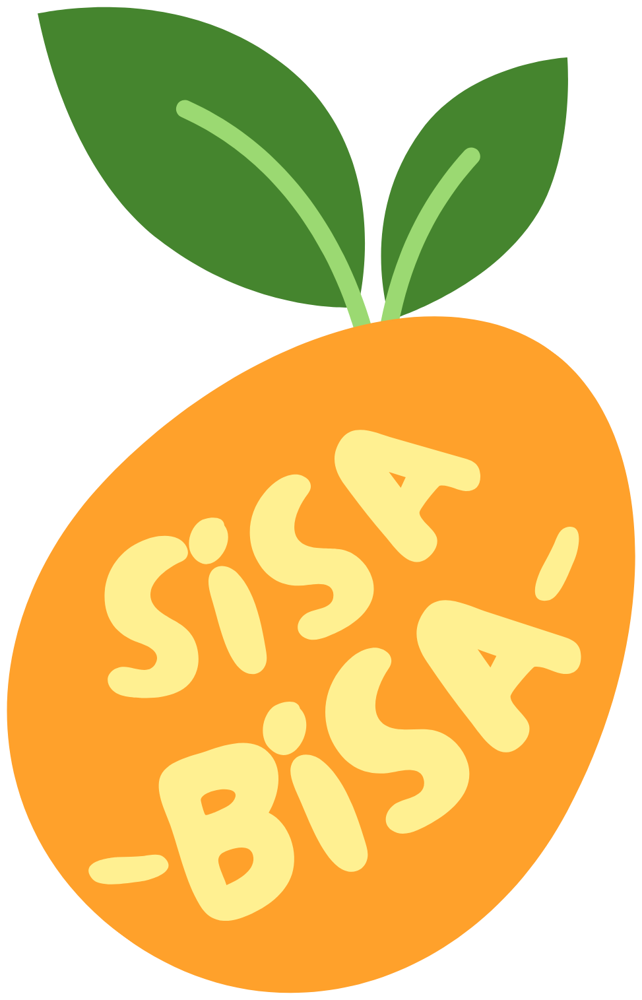
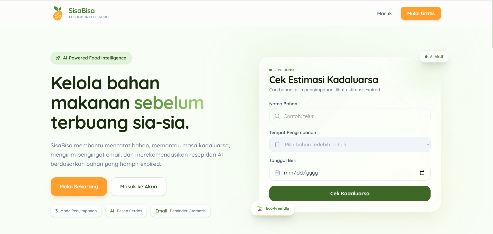
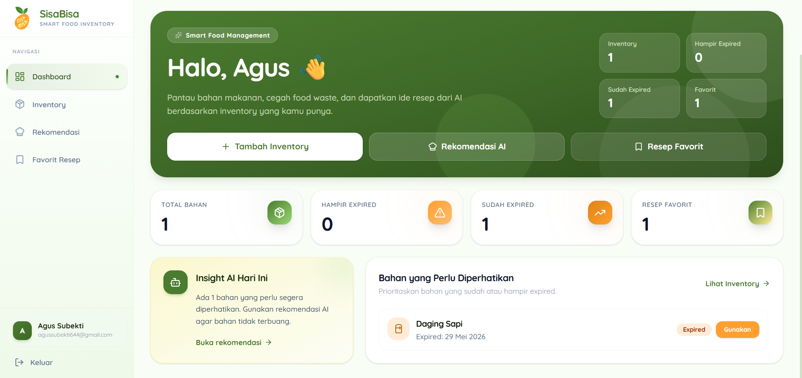
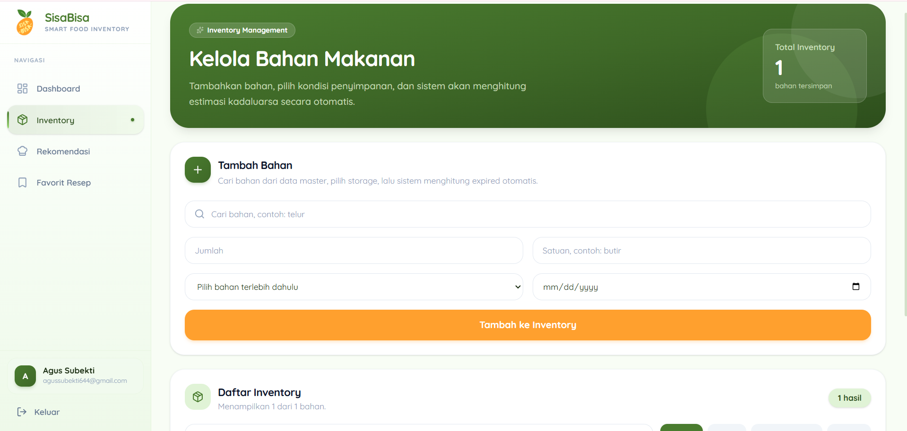
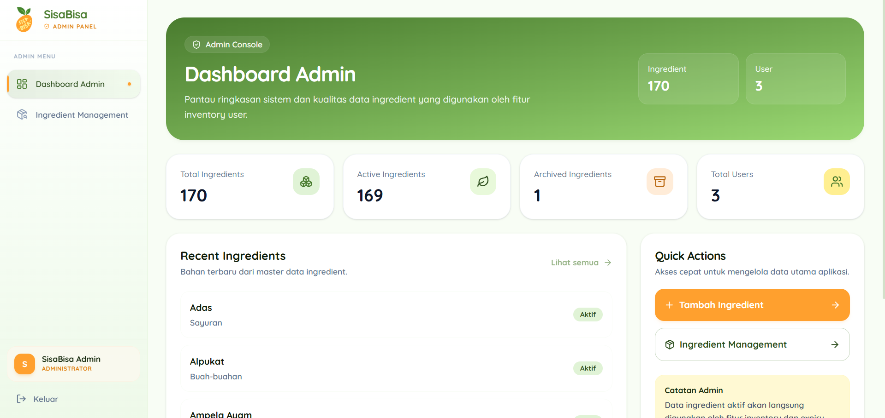
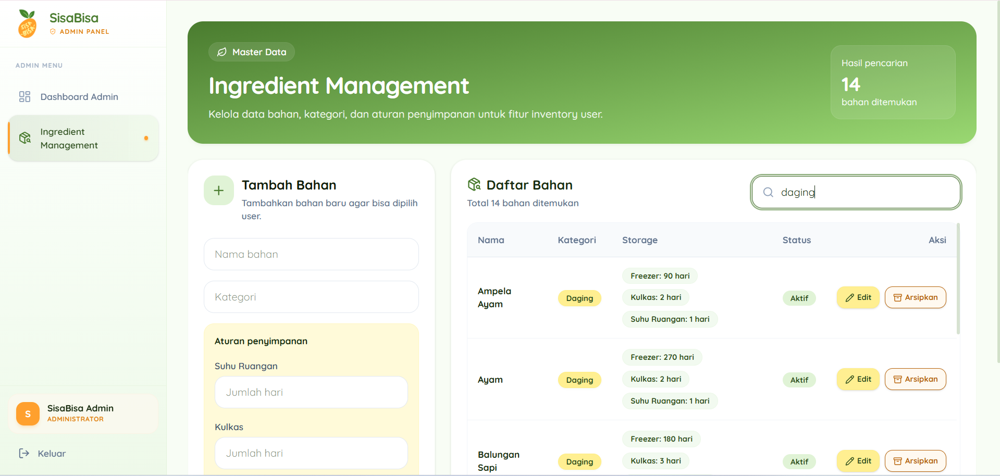

# 🥬 SisaBisa - Smart Food Inventory & AI Recipe Recommendation

<div align="center">



### Smart Food Inventory Management System

Kelola bahan makanan, pantau masa kadaluarsa, kurangi food waste, dan dapatkan rekomendasi resep berbasis AI.

</div>

---

## 📖 About The Project

**SisaBisa** adalah platform manajemen bahan makanan berbasis AI yang membantu pengguna mengelola inventory makanan, memantau masa kadaluarsa, mengurangi food waste, dan memperoleh rekomendasi resep berdasarkan bahan yang tersedia.

Aplikasi ini dikembangkan sebagai proyek **Capstone Coding Camp powered by DBS Foundation** dengan fokus pada pemanfaatan teknologi untuk mengurangi pemborosan makanan (food waste) di lingkungan rumah tangga.

---

## 🎯 Problem Statement

Banyak rumah tangga mengalami masalah seperti:

- Lupa menggunakan bahan makanan sebelum kadaluarsa.
- Tidak mengetahui masa simpan bahan berdasarkan metode penyimpanan.
- Kesulitan menentukan menu masakan dari bahan yang tersedia.
- Sering membuang bahan makanan yang sebenarnya masih dapat dimanfaatkan.

SisaBisa hadir sebagai solusi untuk membantu pengguna mengelola bahan makanan secara lebih efektif, hemat, dan berkelanjutan.

---

# ✨ Features

## 👤 User Features

### 📊 Dashboard Monitoring

- Ringkasan inventory pengguna
- Total bahan aktif
- Bahan hampir expired
- Bahan expired
- Resep favorit
- Insight AI terkait kondisi inventory

---

### 📦 Inventory Management

- Menambahkan bahan makanan
- Menghapus bahan makanan
- Melihat status kadaluarsa bahan
- Filter inventory berdasarkan status
- Pencarian inventory

---

### ⏳ Expiry Checker

- Pencarian bahan dari database master
- Pemilihan metode penyimpanan
- Perhitungan estimasi tanggal kadaluarsa otomatis
- Data berasal dari aturan penyimpanan yang dikelola admin

---

### 🤖 AI Recipe Recommendation

- Rekomendasi resep berdasarkan inventory pengguna
- Pemanfaatan bahan yang hampir expired
- Integrasi model AI

---

### ❤️ Favorite Recipes

- Menyimpan resep favorit
- Mengakses resep yang sering digunakan

---

### 📧 Email Reminder

- Pengingat bahan yang mendekati masa kadaluarsa
- Notifikasi dikirim melalui email

---

# 🛡️ Admin Features

## 📈 Dashboard Admin

Menampilkan:

- Total ingredient
- Total ingredient aktif
- Total ingredient diarsipkan
- Total pengguna
- Ingredient terbaru yang ditambahkan

---

## 🥬 Ingredient Management

Admin dapat:

- Menambahkan ingredient baru
- Mengedit ingredient
- Mengarsipkan ingredient
- Mengaktifkan kembali ingredient
- Mengatur masa simpan berdasarkan metode penyimpanan

Perubahan data ingredient langsung digunakan oleh:

- Expiry Checker
- Inventory User
- AI Recommendation System

---

# 🖼️ Application Preview

## 🌐 Landing Page

Halaman publik yang menampilkan informasi aplikasi dan fitur Expiry Checker yang dapat digunakan tanpa login.



---

## 👤 User Dashboard

Dashboard pengguna untuk memantau inventory dan bahan yang perlu diprioritaskan.



---

## 📦 Inventory Management

Halaman pengelolaan inventory bahan makanan pengguna.



---

## 🛡️ Admin Dashboard

Dashboard untuk memonitor data utama sistem.



---

## 🥬 Ingredient Management

Halaman pengelolaan ingredient yang menjadi master data aplikasi.



---

# 🏗️ System Architecture

```text
Frontend (React + Vite)
        │
        ▼
Backend API (Express.js)
        │
        ▼
PostgreSQL Database (Supabase)
        │
        ├── Users
        ├── Ingredients
        ├── Ingredient Expiry Rules
        ├── User Inventory
        └── Favorite Recipes
        │
        ▼
AI Recommendation Service
(Hugging Face Space)
```

---

# 🛠️ Technology Stack

## Frontend

- React.js
- Vite
- Tailwind CSS
- React Router DOM
- Axios
- React Hot Toast
- Lucide React

---

## Backend

- Node.js
- Express.js
- JWT Authentication
- PostgreSQL
- Supabase

---

## AI & External Services

- Hugging Face Space
- Resend API
- Nodemailer

---

## Deployment

- Frontend : Vercel
- Backend : Railway / Render
- Database : Supabase

---

# 📂 Project Structure

```text
SisaBisa
│
├── frontend
│   ├── public
│   └── src
│       ├── api
│       ├── components
│       ├── context
│       ├── hooks
│       ├── pages
│       ├── services
│       └── utils
│
├── backend
│   ├── config
│   ├── controllers
│   ├── middleware
│   ├── routes
│   ├── services
│   └── utils
│
├── docs
│
└── README.md
```

---

# 🗄️ Main Database Tables

### Users

```sql
users
```

| Field | Type |
|---------|---------|
| id | UUID |
| name | VARCHAR |
| email | VARCHAR |
| password | TEXT |
| role | VARCHAR |

---

### Ingredients

```sql
ingredients
```

| Field | Type |
|---------|---------|
| id | UUID |
| name | VARCHAR |
| category | VARCHAR |
| is_active | BOOLEAN |

---

### Ingredient Expiry Rules

```sql
ingredient_expiry
```

| Field | Type |
|---------|---------|
| ingredient_id | UUID |
| storage | VARCHAR |
| days | INTEGER |

---

### User Inventory

```sql
user_inventory
```

| Field | Type |
|---------|---------|
| id | UUID |
| user_id | UUID |
| ingredient_id | UUID |
| ingredient_name | VARCHAR |
| quantity | NUMERIC |
| unit | VARCHAR |
| storage | VARCHAR |
| expired_at | DATE |

---

### Favorite Recipes

```sql
favorite_recipes
```

---

# ⚙️ Installation

## Clone Repository

```bash
git clone https://github.com/username/sisabisa.git
```

---

## Frontend Setup

```bash
cd frontend

npm install

npm run dev
```

Frontend akan berjalan pada:

```text
http://localhost:5173
```

---

## Backend Setup

```bash
cd backend

npm install

npm run dev
```

Backend akan berjalan pada:

```text
http://localhost:3000
```

---

# 🔐 Environment Variables

## Backend (.env)

```env
PORT=3000

DB_USER=
DB_HOST=
DB_NAME=
DB_PASSWORD=
DB_PORT=

JWT_SECRET=

RESEND_API_KEY=

AI_API_URL=

MAIL_HOST=
MAIL_PORT=
MAIL_SECURE=

MAIL_USER=
MAIL_PASS=
MAIL_FROM=
```

---

## Frontend (.env)

```env
VITE_API_URL=http://localhost:3000
```

---

# 🚀 Future Development

## Short-Term Roadmap

- Push Notification
- Inventory Analytics
- Recipe Search Improvement
- Better AI Recommendation

---

## Long-Term Roadmap

- Mobile Application
- OCR Ingredient Scanner
- Smart Shopping List
- Food Waste Prediction
- Personalized Nutrition Recommendation

---

# 👥 Team

## Full Stack Developer

### CFCC119D6Y2465
**Agus Subekti**

### CFCC694D6Y1122
**Afnan Putra Yulianto**

---

## Data Scientist

### CDCC006D6X1781
**Hyacintha Shafa Athalia Hardianto**

### CDCC006D6X2352
**Gavrilla Claudia Andhinie Hendi**

---

## AI Engineer

### CACC119D6Y0707
**Riyan Sandi Prayoga**

### CACC119D6Y2563
**Michael Mathew**

---

# 📜 License

This project was developed as part of the Coding Camp Capstone Project and is intended for educational and portfolio purposes.

MIT License © 2026 SisaBisa Team

---

<div align="center">

### 🌱 Reducing Food Waste Through Technology

Built with ❤️ by Team SisaBisa

</div>